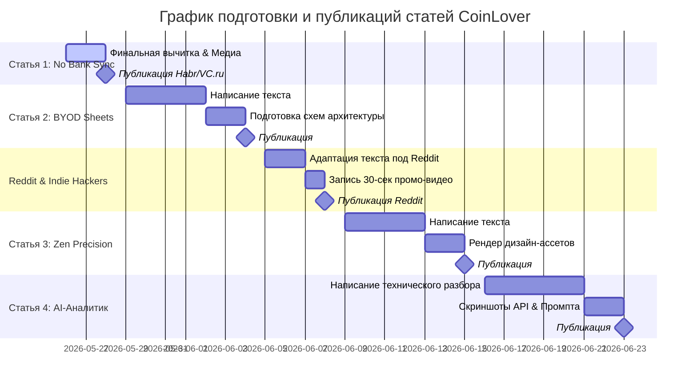

# 📅 Контент-план по написанию и публикации статей для CoinLover

Этот документ объединяет ключевые смыслы, философию продукта (Zen Precision, Data Ownership, ручной осознанный ввод) и технические решения CoinLover в единый план продвижения через полезные экспертные публикации.

---

## 🎯 Стратегические цели контент-маркетинга
1. **Привлечение качественной аудитории (Early Adopters):** Дизайнеры, IT-специалисты, энтузиасты селф-хостинга и приватности.
2. **Получение обратной связи (Feedback loop):** Приглашение в закрытый бета-тест и наполнение списка ожидания (Waitlist) в обмен на бесплатный Lifetime доступ к Pro-фичам.
3. **Формирование экспертности вокруг бренда:** Распространение концепции BYOD (Bring Your Own Database) и Zen Precision в UX.

---

## 🗺 Карта публикаций и тем

| № | Тема / Заголовок статьи | Целевая платформа | Ключевая аудитория | Статус готовности |
|---|-------------------------|-------------------|---------------------|-------------------|
| 1 | **Почему я убрал банковскую синхронизацию из своего финтех-приложения** | VC.ru, Хабр | Продукт-менеджеры, предприниматели, эстеты | Выпущена (https://vc.ru/life/2933682-pochemu-ya-ubral-bankovskuyu-sinhronizaciyu-iz-svoego-finteh-prilozheniya) |
| 2 | **Bring Your Own Database (BYOD): как сделать приложение, где база данных принадлежит пользователю (Google Sheets)** | Хабр, VC.ru | Разработчики, гики, сторонники приватности | **Тезисы готовы** (нужна статья) |
| 3 | **Zen Precision в дизайне: Как превратить скучную домашнюю бухгалтерию в тактильную игру** | Хабр, Dribbble, Medium | UI/UX дизайнеры, фронтендеры, эстеты | **Тезисы готовы** (нужна статья) |
| 4 | **Карманный AI-аналитик: как подключить Gemini к Google Sheets пользователя без сохранения данных на сервере** | Хабр, VC.ru | AI-энтузиасты, Fullstack разработчики | **Архитектура готова** (нужна статья) |
| 5 | **Instagram-like Stories внутри React PWA: Интерактивный онбординг и геймификация личных финансов** | Хабр, Medium | React/Frontend разработчики | **Реализовано** (нужна статья) |
| 6 | **Исповедь соло-разработчика: Как запустить PWA-приложение без App Store и Google Play и собрать первых 1000 юзеров** | Reddit, VC.ru, IndieHackers | Соло-фаундеры, инди-хакеры | **Тезисы готовы** (нужна статья) |

---

## 📄 Детализация статей

### 1. Статья: «Почему я убрал банковскую синхронизацию из своего финтех-приложения»
*   **Платформа:** VC.ru (основной упор на философию и продукт), Хабр (с упором на UX-решения).
*   **Главный месседж:** Автоматизация учета трат убивает осознанность и финансовую гигиену. Ручной ввод — это не архаизм, а инструмент контроля, если он сделан с нулевым сопротивлением (zero friction) через механику Drag-and-Drop.
*   **Визуальный ряд:**
    *   Анимированная гифка процесса перетаскивания (Drag & Drop) монетки из кошелька в категорию расхода (показ нулевого трения).
    *   Скриншот интерфейса Bento Grid и Midnight Gold тем.
*   **Статус:** **Черновик написан** (находится в [Article_1_No_Bank_Sync.md](file:///Users/eugene/MyProjects/CoinLover/%21Docs/Articles/Article_1_No_Bank_Sync.md)). Требуется финальная вычитка, добавление медиа-ассетов и публикация.

---

### 2. Статья: «Bring Your Own Database (BYOD) в B2C: Как запустить финтех-приложение с базой данных в Google Sheets»
*   **Платформа:** Хабр (раздел Разработка / Веб-технологии / Информационная безопасность).
*   **Главный месседж:** Приватность мертва на чужих серверах. Мы построили архитектуру, где бэкенд CoinLover выступает лишь временным шлюзом-транслятором, а все данные транзакций лежат в Google Sheets пользователя. Это защищает от утечек, закрытия сервиса и дает безграничные возможности для кастомного анализа данных.
*   **Ключевые технические аспекты:**
    *   Решение проблем CORS и безопасная работа через VPS Proxy с использованием Service Account.
    *   Защита мастер-таблицы (MASTER_SS_ID) и беспарольный вход по уникальной ссылке.
    *   Snapshot-based синхронизация и алгоритмы разрешения конфликтов (Conflict Resolution) при одновременной работе с нескольких устройств.
    *   Форматирование дат и защита от утечки ISO-формата через `formatDateTime()`.
*   **Визуальный ряд:** 
    *   Инфографика/схема архитектуры (Frontend -> API Vercel -> Google Sheets API -> Sheets пользователя).
    *   Скриншот Google Таблицы пользователя с аккуратно сгенерированной структурой транзакций.

---

### 3. Статья: «Zen Precision в дизайне: Эстетика против бухгалтерии»
*   **Платформа:** Хабр (Дизайн / Юзабилити), Medium (UX/UI design).
*   **Главный месседж:** Манифест финансовой ясности. Финансовый учет не должен выглядеть как скучная 1С-бухгалтерия. Мы отказались от перенасыщенных градиентов, агрессивных цветов и сложных нагромождений в пользу архитектурной тишины, Linear-минимализма и швейцарского формализма (Zen Precision).
*   **Ключевые темы:**
    *   *Цветовая сдержанность:* Использование Obsidian Black, Slate Grey, приглушенного Organic Mint вместо «вырвиглазных» базовых цветов.
    *   *Микро-анимации:* Как тактильный отклик и мгновенная физика монеток создают ощущение живого интерфейса.
    *   *Типографика как структура:* Встраивание баланса в ДНК хедера (использование Inter Tight).
*   **Визуальный ряд:**
    *   Качественные рендеры или скриншоты контрастных тем (Dark vs Light vs Organic Mint).
    *   Сравнение элементов интерфейса CoinLover с классическими «табличными» конкурентами.

---

### 4. Статья: «Карманный AI-аналитик: как подключить Gemini к Google Sheets пользователя без сохранения данных на сервере»
*   **Платформа:** Хабр (Искусственный интеллект / Разработка веб-приложений).
*   **Главный месседж:** Практическое руководство по созданию встроенного ИИ-консультанта. Как позволить пользователю задавать аналитические вопросы (*«сколько ушло на такси за 50 дней»*) без сложной инфраструктуры, баз данных и риска утечки данных.
*   **Ключевые технические аспекты:**
    *   Ограничение контекста: выкачивание транзакций только за последние 60-90 дней.
    *   Экономия токенов на 70%: упаковка данных в плоский, ультра-компактный CSV-формат вместо раздутого JSON.
    *   Системный промпт для точных математических расчетов на структурированных данных.
    *   Выбор Gemini 1.5/3.5 Flash: преимущества гигантского контекстного окна и сверхнизкой цены (в 10-15 раз дешевле аналогов) при высокой скорости (до 1 секунды на ответ).
*   **Визуальный ряд:**
    *   Инфографика взаимодействия (Frontend -> Vercel Serverless -> Supabase -> Sheets API -> Gemini -> Markdown ответ).
    *   Скриншот чат-панели в премиальном Glassmorphism-стиле с примером диалога.

---

### 5. Статья: «Истории в стиле Instagram внутри React PWA: Интерактивный онбординг и геймификация»
*   **Платформа:** Хабр (раздел Разработка под Web / React).
*   **Главный месседж:** Как внедрить Stories-архитектуру в веб-приложение, сделав его неотличимым от нативного iOS/Android приложения.
*   **Ключевые темы:**
    *   Плавное перелистывание слайдов (multi-slide) внутри одного кружка с автопереходом.
    *   Логика жестов: пауза при удержании экрана (on hold) и быстрые тапы слева/справа для навигации.
    *   Гибридный алгоритм расчета No-Spend Day («Дзен») в Stories с принудительной очисткой от UTC/локальных временных сдвигов через строковые префиксы и `safeParseDate`.
    *   Полная адаптация под темы (Dark, White, Mint).
*   **Визуальный ряд:**
    *   Видео или интерактивная гифка перелистывания Stories на смартфоне в PWA.
    *   Кусочки кода обработчиков тач-событий (`onTouchStart`, `onTouchEnd`).

---

### 6. Пост / Статья: «I got frustrated with complex budgeting apps, so I built a minimal finance tracker with a satisfying drag-and-drop coin mechanic.» (Исповедь соло-разработчика)
*   **Платформа:** Reddit (сообщества `r/SideProject`, `r/indiehackers`, `r/iosapps`), IndieHackers.
*   **Главный месседж:** Исповедь разработчика, уставшего от сложных корпоративных комбайнов с навязчивыми подписками. Создание легкого, тактильного PWA, которое летает везде и уважает приватность.
*   **Специфика подачи:** Исключительно полезная, искренняя подача с фокусом на UX, без прямой рекламы. Главный упор на интерактивное вовлечение: *"Дарю пожизненный Pro всем, кто найдет критический баг или даст честный фидбек"*.
*   **Визуальный ряд:** Короткое зацикленное видео (до 30 сек) с демонстрацией работы PWA на телефоне, сменой тем и плавными монетами.

---

## 📈 План публикаций по неделям (Organic Growth)

---

## 🛠 Чек-лист для запуска каждой статьи
- [ ] **Визуальный триггер:** Создана качественная гифка (до 10 МБ) или видео процесса перетаскивания монет, либо Bento-интерфейса.
- [ ] **Проверка ссылок:** Указана корректная ссылка на промо-лендинг ([coinlover.ru/landing](https://coinlover.ru/landing)) с правильными UTM-метками.
- [ ] **Призыв к действию (CTA):** В конце статьи размещено приглашение в закрытый Telegram-чат бета-тестеров (CoinLover Insiders) с обещанием Pro-аккаунта за фидбек.
- [ ] **Аналитика:** На лендинге настроены события для отслеживания переходов с конкретной платформы (клики по кнопкам регистрации `btn_signup_top/bottom`, открытие модального окна `modal_open`, отправка формы `generate_lead`).
