# 📂 Отчет об анализе архива документации и План реструктуризации

Этот отчет содержит полный анализ 30 архивных файлов из директории `!Docs/Archive` (общий объем ~180 КБ). Все документы были тщательно изучены, разбиты по категориям актуальности и распределены по смысловым блокам новой единой структуры документации CoinLover.

---

## 🗺 Новая структура документации (Obsidian Hub)

Вместо разрозненных 30 файлов мы создаем **8 структурированных хабов знаний** в директории `!Docs`. Это упростит навигацию, уберет дублирование информации и сделает базу знаний удобной для дальнейшей работы ИИ и человека.

```mermaid
graph TD
    subgraph "Входной Архив (!Docs/Archive)"
        A1[01_PRODUCT_STRATEGY]
        A2[02_TECHNICAL_GUIDE]
        A3[03_ROADMAP_AND_PLANS]
        A4[DND_MANUAL]
        A5[PROJECT]
        A6[SOLUTIONS]
        A7[DECISIONS_LOG]
        A8[KnowledgeBase]
        A9[DEMO-РЕЖИМ]
        A10[ОБНОВЛЯЕМ ИЗ БД]
        A11[Обзор конкурентов]
        A12[ОТЗЫВЫ_О_ПРИЛОЖЕНИЯХ]
        A13[FinPLAN-Gemini]
        A14[LANDING_ADVANTAGES]
        A15[MAIN_FUNCTIONS]
        A16[SCRIPT_SCREENCAST]
        A17[POST]
        A18[РЕКОМЕНДАЦИИ CEO]
        A19[Статья1 - vc.ru]
        A20[тезисы для статьи]
        A21[BASE_CURRENCY_PLAN]
        A22[onboarding_showcase]
        A23[routing_fix]
        A24[Битые файлы / Внешние статьи]
    end

    subgraph "Новый Центр Знаний (!Docs/)"
        H1["🛠 Technical_Guide.md"]
        H2["📖 Decisions_Log.md"]
        H3["💡 KnowledgeBase.md"]
        H4["📊 Competitor_Analysis.md"]
        H5["📣 Marketing_Strategy.md"]
        H6["🔍 SEO_Recommendations.md"]
        H7["📝 Articles/Article_1_No_Bank_Sync.md"]
        H8["📝 Articles/Article_Tezisy.md"]
    end

    A2 & A4 & A5 --> H1
    A6 & A7 --> H2
    A8 & A9 & A10 --> H3
    A11 & A12 --> H4
    A1 & A3 & A13 & A14 & A15 & A16 & A17 --> H5
    A18 --> H6
    A19 --> H7
    A20 & A17 --> H8

    A21 & A22 & A23 -->|Удалить / Реализовано| Trash[🗑 Корзина / Архив выполненного]
    A24 -->|Удалить / Неактуально| Trash
```

---

## 📊 Детальная классификация файлов

Все 30 файлов разделены на 4 категории по степени актуальности:

| Файл | Статус | Суть документа | Решение и действие |
| :--- | :---: | :--- | :--- |
| **01_PRODUCT_STRATEGY.md** | 🟡 Частично | Уникальные преимущества (УТП) и продуктовый бэклог. | Перенести ценные разделы (Competitive Edge, Value Propositions) в **Marketing_Strategy.md**. |
| **02_TECHNICAL_GUIDE.md** | 🟢 Актуален | Описание архитектуры (React 19, Node Proxy, Google Sheets, Service Account). | Перенести в **Technical_Guide.md**. |
| **03_ROADMAP_AND_PLANS.md** | 🟡 Частично | Роадмап 2026, монетизация и анонсы. Часть Q1 уже закрыта. | Обновить планы Q2-Q3 и перенести в **Marketing_Strategy.md**. |
| **10 лучших приложений...** | 🔴 Устарел | Копия статьи Лайфхакера с обзором сторонних приложений. | **Удалить**. Все полезные выводы перенесены в анализ конкурентов. |
| **BASE_CURRENCY_PLAN.md** | 🔵 Внедрен | План выбора валюты USD/EUR при первом подключении. | **Удалить**. Фича полностью реализована в кодовой базе. |
| **CoinLover UTM.md** | 🔴 Устарел | Маркетинговая ссылка с UTM-меткой. | **Удалить**. UTM-параметры сохранены в маркетинговых логах. |
| **DECISIONS_LOG.md** | 🟢 Актуален | Записи архитектурных решений (Smart Currency, PWA persistence, Mint Theme 2.0). | Перенести в **Decisions_Log.md**. |
| **DEMO-РЕЖИМ.md** | 🟡 Частично | Описание логики демо-режима, жестов и URL-параметров. | Обновить (убрать удаленные с лендинга демо-кнопки) и слить с **KnowledgeBase.md**. |
| **DND_MANUAL.md** | 🟢 Актуален | Техническое описание механики DnD жестов, scale-эффектов и фикса смещения на Desktop. | Перенести в **Technical_Guide.md** (раздел DND Manual). |
| **FinPLAN-Gemini.md** | 🟡 Частично | Маркетинговый план, УТП, каналы продвижения, Waitlist-стратегия. | Перенести в **Marketing_Strategy.md**. |
| **KnowledgeBase.md** | 🟢 Актуален | Пользовательская база знаний (инструкция по шарингу Google Sheet, темы, FAQ). | Перенести в **KnowledgeBase.md**. |
| **LANDING_ADVANTAGES.md** | 🟢 Актуален | Преимущества CoinLover (Data Ownership BYOD, приватность) для лендинга. | Перенести в **Marketing_Strategy.md** (раздел Landing). |
| **MAIN_FUNCTIONS.md** | 🟡 Частично | Наброски лозунгов для Stories и акценты на функции. | Объединить с **Marketing_Strategy.md** и удалить. |
| **MULTI_TENANT_STEPS.md** | 🟡 Частично | Шаги по переходу на multi-tenant (изоляция таблиц, Auth, Code.gs). | Перенести в **Technical_Guide.md** в раздел "Будущая архитектура". |
| **PLAN-CODE.md** | 🔴 Мусор | Битый бинарный файл. | **Удалить**. |
| **PLAN-MULTIUSER.md** | 🔴 Мусор | Битый бинарный файл. | **Удалить**. |
| **POST.md** | 🟡 Частично | Текст промо-поста анонса CoinLover в соцсетях. | Объединить с тезисами статей в **Articles/Article_Tezisy.md** и удалить. |
| **PROJECT.md** | 🟢 Актуален | Разбор фиксов скролла, All States at Top, авто-провижн и Capacitor safe-area. | Объединить с **Technical_Guide.md**. |
| **SCRIPT_SCREENCAST_2026.md**| 🟡 Частично | Сценарий промо-видео (скринкаста) с таймингом сцен. | Перенести в **Marketing_Strategy.md** (раздел Видео). |
| **SOLUTIONS.md** | 🟢 Актуален | База решений критических багов (iOS PWA standalone, Safe Area Android, CapacitorHttp). | Перенести в **Decisions_Log.md** (или объединить с глобальным SOLUTIONS.md). |
| **onboarding_showcase_plan.md**| 🔵 Внедрен | План реализации анимированного онбординга. | **Удалить**. Фича полностью реализована. |
| **onboarding_showcase_walkthrough.md**| 🔵 Внедрен | Отчет об интеграции FeatureShowcase в OnboardingModal. | **Удалить**. Фича полностью реализована. |
| **routing_fix_plan.md** | 🔵 Внедрен | План исправления роутинга и перехода на getPlatform(). | **Удалить**. Фича полностью реализована. |
| **routing_fix_walkthrough.md**| 🔵 Внедрен | Отчет о фиксе веб-маршрутизации на coinlover.ru. | **Удалить**. Фича полностью реализована. |
| **ОБНОВЛЯЕМ ИЗ БД.md** | 🟢 Актуален | Руководство по прямому наполнению Google Таблицы и синхронизации балансов. | Перенести в **KnowledgeBase.md** в раздел "Продвинутое использование". |
| **ОТЗЫВЫ_О_ПРИЛОЖЕНИЯХ_2026.md**| 🟢 Актуален | Сборник отзывов о конкурентах для выявления сильных сторон. | Объединить со сравнительным анализом в **Competitor_Analysis.md**. |
| **Обзор конкурентов CoinLover.md**| 🟢 Актуален | Глубокий сравнительный анализ (CoinKeeper, Monefy, Spendee, Дзен-мани, Toshl) с таблицей. | Перенести в **Competitor_Analysis.md**. |
| **РЕКОМЕНДАЦИИ CEO.md** | 🟡 Частично | Чек-лист SEO-оптимизации (H1, Meta descriptions, OpenGraph). | Перенести в **SEO_Recommendations.md**. |
| **Статья1 - vc.ru...** | 🟢 Актуален | Готовая статья о философии ручного ввода и Data Ownership. | Перенести в **Articles/Article_1_No_Bank_Sync.md**. |
| **тезисы для статьи Coinlover.md**| 🟢 Актуален | Подробные тезисы и структура статей для Habr и Reddit с разбором триггеров. | Перенести в **Articles/Article_Tezisy.md**. |

---

## 🛠 План слияния и реструктуризации (Restructuring Checklist)

Чтобы выполнить слияние быстро, аккуратно и без потери ценных данных, предлагается следующий пошаговый алгоритм:

### Шаг 1: Формирование Технического Хаба (`Technical_Guide.md`)
- [ ] Объединить исходный `02_TECHNICAL_GUIDE.md` с технической концепцией из `PROJECT.md`.
- [ ] Добавить в конец раздел **"DND Manual (Механика жестов)"** из `DND_MANUAL.md`.
- [ ] Интегрировать раздел **"Перспективы: Переход на Multi-Tenant"** на основе документа `MULTI_TENANT_STEPS.md`.

### Шаг 2: Создание Лога Решений (`Decisions_Log.md`)
- [ ] Записать исходный `DECISIONS_LOG.md` как основу.
- [ ] Добавить в конец подробный раздел **"Troubleshooting & Solutions (База решений)"** на основе `SOLUTIONS.md`.

### Шаг 3: Наполнение Пользовательского Руководства (`KnowledgeBase.md`)
- [ ] Перенести основу `KnowledgeBase.md`.
- [ ] Интегрировать актуальную логику **Demo-режима** из `DEMO-РЕЖИМ.md` (секретные параметры входа, long-press на монетке).
- [ ] Добавить раздел **"Ручное обновление данных и прямая запись в Google Sheets"** из `ОБНОВЛЯЕМ ИЗ БД.md`.

### Шаг 4: Сборник Анализа Рынка (`Competitor_Analysis.md`)
- [ ] Импортировать детальный `Обзор конкурентов CoinLover.md`.
- [ ] Добавить аналитический раздел **"Голос Пользователя: Отзывы о конкурентах (2025-2026)"** на основе выжимок из `ОТЗЫВЫ_О_ПРИЛОЖЕНИЯХ_2026.md`.

### Шаг 5: Создание Маркетингового Хаба (`Marketing_Strategy.md`)
- [ ] Слить воедино:
  - `FinPLAN-Gemini.md` (маркетинг-план, Waitlist и Concierge MVP)
  - `03_ROADMAP_AND_PLANS.md` (планы Q2-Q3 2026, роадмап)
  - `LANDING_ADVANTAGES.md` (Value Propositions для лендинга)
  - `MAIN_FUNCTIONS.md` (лозунги для Stories)
  - `SCRIPT_SCREENCAST_2026.md` (сценарий видео-шоукейса)

### Шаг 6: Раздел SEO-Оптимизации (`SEO_Recommendations.md`)
- [ ] Перенести актуальные рекомендации из `РЕКОМЕНДАЦИИ CEO.md` для дальнейшего контроля за лендингом.

### Шаг 7: Статьи и Промо-материалы (`Articles/`)
- [ ] Создать директорию `Articles/`.
- [ ] Сохранить статью `Articles/Article_1_No_Bank_Sync.md` (на основе vc.ru черновика).
- [ ] Создать `Articles/Article_Tezisy.md`, объединив тезисы с анонсом `POST.md`.

### Шаг 8: Физическая чистка архива `!Docs/Archive`
- [ ] После Вашего утверждения и успешного выполнения Шагов 1-7, мы удалим все 30 временных файлов из `!Docs/Archive/` (и сам файл `scratch/all_archive_files.txt`), оставив только чистую, структурированную базу знаний в `!Docs/`.

---

> [!TIP]
> **Ваш шаг**: Ознакомьтесь с планом и классификацией файлов. Если Вы согласны с такой структурой и планом реструктуризации, подтвердите Ваше одобрение, и я немедленно приступлю к физическому слиянию файлов и чистке архива. Если у Вас есть пожелания или изменения по структуре — напишите, и мы скорректируем план.
