# Архитектура и реализация встроенного AI-аналитика в CoinLover

Встроенный **AI-чат и аналитик** в приложении CoinLover предоставляет бесшовный пользовательский опыт (UX) для анализа личных финансов и быстрого внесения транзакций с помощью естественного языка и голосовых команд.

---

## 1. Как это работает (Пользовательский сценарий)

### А. Текстовый ввод
1. Приложение предоставляет кнопку вызова AI.
2. В интерфейсе открывается чат-панель (в фирменном Linear/Glassmorphism стиле: темный блюр-фон, фиолетовые акценты).
3. Пользователь пишет текстовый запрос: *«сколько я потратил на такси за последний месяц?»*.

### Б. Голосовой ввод через FAB (Floating Action Button)
1. Пользователь зажимает главную FAB-кнопку на **800 мс** ([src/components/layout/AppHeader.tsx](file:///Users/eugene/MyProjects/CoinLover/src/components/layout/AppHeader.tsx#L214-L223)).
2. Происходит проверка тарифа (`tariff === "Premium"`). Если у пользователя бесплатный тариф, открывается модалка Premium.
3. Если тариф Premium, срабатывает виброотклик (haptic feedback), открывается `AISheet` и **автоматически запускается запись голоса**.
4. Пользователь диктует команду: *«запиши расход на обед 450 рублей с карты»*.
5. Панель транскрибирует речь локально и сразу отправляет запрос ИИ.

---

## 2. Техническая архитектура и поток данных

```mermaid
sequenceDiagram
    actor User as Пользователь
    participant App as AppHeader / AISheet (Frontend)
    participant WebSpeech as Web Speech API (Браузер / WebView)
    participant Server as /api/ai-analyst (Express/VPS)
    participant Sheets as Google Sheets API
    participant LLM as OpenRouter (Gemini 2.5 Flash)

    User->>App: Зажимает FAB (800мс) / Кликает "Микрофон"
    App->>App: Проверяет Premium-тариф
    App->>WebSpeech: Запрашивает права на аудио и запускает запись
    User->>WebSpeech: Говорит команду ("купил кофе за 200")
    WebSpeech->>App: Возвращает распознанный текст (транскрипт)
    App->>Server: POST /api/ai-analyst { ssId, query: "купил кофе за 200" }
    
    rect rgb(30, 30, 35)
        Note over Server, Sheets: Серверная агрегация данных
        Server->>Sheets: Получает Configs & Transactions
        Server->>Server: Считает все суммы по категориям/тегам (защита от галлюцинаций LLM)
    end

    Server->>LLM: Шлет prompt (Системные правила + Агрегации + Запрос)
    LLM-->>Server: Возвращает JSON-действие / Текстовый анализ
    Server-->>App: Ответ (JSON или Markdown)
    
    alt Получена JSON команда (add_transaction)
        App->>User: Показывает форму быстрого подтверждения кошелька
        User->>App: Подтверждает ("Записать в...")
        App->>Server: POST /api/sheets (Вносит запись в таблицу)
    else Текстовый анализ
        App->>User: Отображает Markdown ответ с аналитикой
    end
```



---

## 3. Детали реализации и оптимизации

### А. Защита от ложных кликов (FAB UX)
При удержании FAB запускается таймер хука `useLongPress` ([src/hooks/useLongPress.ts](file:///Users/eugene/MyProjects/CoinLover/src/hooks/useLongPress.ts)). Чтобы после отпускания пальца не происходил ложный клик (который обычно вызывает открытие меню настроек), в момент активации `AISheet` кнопка FAB полностью размонтируется:
```typescript
{!isAISheetOpen && (
  <button {...settingsLongPress} onClick={handleMenuClick}>...</button>
)}
```
Исчезновение элемента из DOM до генерации браузерного события `click` прерывает цепочку событий.

### Б. Распознавание речи на мобильных устройствах (Capacitor)
* Функция `startVoiceRecording()` инициализирует стандартный интерфейс `SpeechRecognition` (или `webkitSpeechRecognition`).
* Для нативной работы внутри Android/iOS WebView в Capacitor требуются права доступа к оборудованию. Они прописаны в манифесте приложения ([android/app/src/main/AndroidManifest.xml](file:///Users/eugene/MyProjects/CoinLover/android/app/src/main/AndroidManifest.xml#L32-L37)):
  ```xml
  <uses-permission android:name="android.permission.RECORD_AUDIO" />
  <uses-permission android:name="android.permission.MODIFY_AUDIO_SETTINGS" />
  ```

### В. Исключение математических ошибок LLM (Server-side Aggregation)
Чтобы предотвратить галлюцинации искусственного интеллекта при подсчете больших массивов данных, бэкенд `/api/ai-analyst.ts` выполняет всю математику на сервере:
1. Выгружает транзакции (ограничивая выборку разумным периодом для экономии токенов).
2. Вычисляет точные суммы расходов/доходов по категориям, тегам и месяцам.
3. Передает в модель **уже посчитанные агрегации** (`PRE-COMPUTED FINANCIAL DATA`).
4. Системный промпт жестко запрещает модели самостоятельно пересчитывать, складывать или вычитать любые числа, требуя использовать только готовые значения от сервера.

### Г. Автоматическое распознавание транзакций
Если модель понимает, что пользователь диктует новую транзакцию (например, *"кофе за 3$"*), она возвращает строго структурированный JSON с деталями операции:
```json
{
  "action": "add_transaction",
  "amount": 3,
  "wallet_id": "",
  "category": "Еда/Кафе",
  "tag": "кофе",
  "description": "кофе",
  "is_ambiguous": true
}
```
Приложение перехватывает этот JSON блок и отображает кнопки быстрого подтверждения кошелька списания.

---

## 4. Стек технологий
* **Клиент:** React, Web Speech API (распознавание речи), `useLongPress` (pointer-события).
* **Среда выполнения:** Capacitor (iOS/Android).
* **Сервер:** Express Node.js на VPS, Google Sheets API (выгрузка и сохранение данных).
* **ИИ:** `google/gemini-2.5-flash` через OpenRouter.
