# Продуктовая и техническая архитектура экосистемы CoinLover

Настоящий документ описывает продуктовую концепцию и техническую организацию веб-ресурса **coinlover.ru**, объединяющего три ключевые сущности:
1. **Маркетинговый лендинг** (привлечение, ценностное предложение, конверсия).
2. **Демо-приложение** (интерактивный тест-драйв без барьеров входа).
3. **Рабочее PWA-приложение** (основная среда для ежедневного учета).

---

## 🎯 1. Продуктовая воронка и пути пользователя (User Journeys)

Главная цель сайта `coinlover.ru` — превратить холодного посетителя в активного пользователя, который ежедневно вводит транзакции и доверяет сервису свои данные.

```mermaid
graph TD
    A[Посетитель на coinlover.ru] --> B{Тип устройства и режим}
    B -- Обычный браузер (Десктоп/Мобильный) --> C[Маркетинговый лендинг]
    B -- PWA Standalone / Capacitor --> D[Экран авторизации NativeAuthScreen]
    
    C --> E[CTA 1: Попробовать Демо]
    C --> F[CTA 2: Войти / Начать учет]
    
    E --> G[Демо-режим: Локальная песочница]
    G --> H[Конверсионная плашка: Подключить Sheets]
    H --> I[Экран авторизации / Регистрация]
    
    F --> I
    I --> J[Рабочая PWA среда с Google Sheets]
    
    style G fill:#2e2252,stroke:#6d5dfc,stroke-width:2px
    style J fill:#123524,stroke:#10b981,stroke-width:2px
```

### 1.1. Ветка А: Маркетинговый лендинг
- **Задача:** Мгновенно удивить визуальным премиум-дизайном в стиле **Linear Style** (темная тема `#050505`, шрифт *Inter*, акцентный цвет `#6d5dfc`, скругления `28px` для крупных блоков и `14px` для элементов).
- **Ценностные предложения:**
  - *Drag-and-Drop* как игра (учет расходов превращается в легкую привычку).
  - *Data Ownership* (данные в твоей личной Google Таблице, полная приватность, отсутствие "черных ящиков").
  - *No Bank Sync* (осознанность и финансовая гигиена вместо бесконтрольного автоматического списания).
  - *Multi-currency & Travel-ready* (автоматическая конвертация курсов, удобный учет в поездках).
- **Конверсионные точки:**
  - **Кнопка «Попробовать демо-режим»** (Primary CTA). Ведет в интерактивную песочницу без ввода каких-либо данных.
  - **Кнопка «Начать учет / Подключить»** (Secondary CTA). Открывает модальное окно регистрации и подключения Google Таблицы.

### 1.2. Ветка Б: Демо-приложение (Интерактивная песочница)
- **Задача:** Показать "магию" интерфейса без трения (Zero Friction). Пользователь не должен тратить время на авторизацию и настройку до того, как почувствует ценность.
- **Организация среды:**
  - Запускается мгновенно по адресу `coinlover.ru/demo` или параметру `?demo=true`.
  - **Предустановленный набор данных (Моки):**
    - Кошельки: *Наличные (RUB)*, *Карта (USD)*, *Крипта (USDT)* с демонстрационным балансом.
    - Категории с установленными лимитами: *Продукты*, *Кофе*, *Такси*, *Подписки*.
    - Наполненная история транзакций за текущий месяц (чтобы графики и Bento-аналитика выглядели живыми и полезными с первой секунды).
  - **Микро-онбординг:** Подсвеченная пульсация монетки с подсказкой "Перетащите монету на категорию Еда для первой записи".
  - **Конверсионный крючок (CTA-плашка в шапке):**
    > 💡 **Вы находитесь в Демо-режиме.** Все операции сохраняются локально. Нравится? [**Подключить свою Google Таблицу**]
  - **Wow-фича «Бесшовная миграция»:** При переходе из демо в реальный аккаунт приложение предлагает: *"Перенести транзакции, созданные в демо-режиме, в вашу реальную таблицу?"* Это создает ощущение заботы и ценности.

### 1.3. Ветка В: Рабочее PWA-приложение (Личный финансовый хаб)
- **Задача:** Быстрый, бесперебойный, надежный ввод транзакций и глубокая аналитика.
- **Организация среды:**
  - Запускается, если у пользователя в LocalStorage или Cookies сохранен валидный `ssId` (ID Google Таблицы).
  - Автоматически синхронизирует состояние с облаком через VPS-прокси (`/api/sheets`).
  - Сохраняет сессию даже при отсутствии интернета (оффлайн-ввод с последующим фоновым пушем).
  - **Standalone PWA / Capacitor (Мобильные платформы):** При запуске в режиме "Добавить на экран Домой" (`display-mode: standalone`) или внутри нативного приложения Capacitor, система полностью минует маркетинговый лендинг и сразу показывает экран авторизации `NativeAuthScreen` (если пользователь не залогинен).

---

## 🛠 2. Архитектура доменов и роутинга (Routing & Domain Strategies)

Для организации трех веток существует два основных архитектурных подхода.

### Вариант 1 (Рекомендуемый): Единое SPA-приложение с динамическим роутингом (Path-based SPA)
Все три сущности живут в одном React-приложении, а разделение происходит на уровне роутера (например, React Router или кастомный легковесный роутер на основе `window.location.pathname`).

- **Адресация:**
  - `coinlover.ru/` — Лендинг (всегда показывается в обычном браузере на десктопе и мобильном).
  - `coinlover.ru/demo` — Демо-песочница (принудительно включает `localStorage` демо-режим).
  - `coinlover.ru/app` — Основная рабочая среда (редиректит на `/auth`, если `ssId` не найден).
  - `coinlover.ru/auth` — Экран авторизации.
  - `coinlover.ru/s/:ssId` — Прямой вход для пользователя по ссылке из мастер-таблицы (автоматически сохраняет ID в куки/localStorage и перенаправляет на `/app`).

#### 💡 Решение по `isNativeApp`
Мы **убираем глобальную проверку `isNativeApp` для обычных браузеров**.
- В обычном браузере (на любом устройстве) неавторизованный пользователь **всегда видит лендинг** `LandingPage`. Это позволяет мобильным пользователям ознакомиться с продуктом, почитать FAQ и покрутить лендинг, вместо того чтобы сразу натыкаться на "голый" мобильный логин.
- Проверка на standalone-режим (`isStandalone` / `window.matchMedia('(display-mode: standalone)').matches`) остается **только для установленного PWA или нативного Capacitor-приложения**. Когда пользователь открывает иконку приложения с экрана "Домой" или запускает APK, ему не нужен лендинг — приложение сразу редиректит его на `/app` (и на `NativeAuthScreen` для логина, если он не авторизован).

---

## 💾 3. Реализация Демо-режима (Local-First Sandbox)

Текущая реализация демо-режима в бэкенде использует shared-таблицы на сервере (`Configs-demo`, `Transactions-demo` в мастере), что при одновременном использовании несколькими пользователями приведет к конфликтам и перезаписи данных.

### Предлагаемое решение: Полный Local-First Demo-режим
1. **Локальный жизненный цикл данных:**
   - В демо-режиме приложение **не делает запросов к серверу** для сохранения/изменения транзакций.
   - Все операции CRUD (создание, редактирование, удаление транзакций, редактирование кошельков/категорий) записываются исключительно в `localStorage` с префиксом `cl_demo_`.
2. **Инициализация красивым шаблоном:**
   - При первом входе в демо-режим в `localStorage` записывается предустановленная база данных (моковые счета, категории с лимитами и 15-20 транзакций за последние 30 дней).
   - Это гарантирует, что графики аналитики будут сразу наполнены и интерактивны.
3. **Бесшовная конверсия в реального пользователя:**
   - Когда пользователь кликает на плашке демо "Начать реальный учет", открывается модальное окно авторизации.
   - После успешного подключения Google Sheets, приложение проверяет наличие демо-транзакций в `localStorage`.
   - Если они есть, показывается красивый попап:
     > ⚡ **Хотите сохранить историю?** Мы можем автоматически перенести все ваши демо-транзакции в вашу новую Google Таблицу. [**Перенести данные**] / [Начать с чистого листа]
   - При согласии запускается процедура последовательного пуша локальных демо-транзакций в свежеинициализированную таблицу.

---

## 📱 4. Мобильная дистрибуция: QR-коды и Email-онбординг

Чтобы упростить установку PWA-приложения на смартфон (особенно для iOS, где установка возможна только через Safari и меню "Поделиться" -> "На экран Домой"), мы внедряем двухканальную систему доставки ссылки на мобильное устройство.

### 4.1. Автоматическая генерация QR-кода
1. **Где показывается:**
   - В модальном окне успешной регистрации/подключения таблицы на десктопе.
   - В разделе "Установить на телефон" внутри меню настроек основного приложения.
2. **Как работает:**
   - Фронтенд генерирует динамический QR-код (с помощью легкой JS-библиотеки или быстрого open-source API).
   - QR-код содержит прямую ссылку вида `https://coinlover.ru/s/[ssId]`.
   - Пользователь наводит камеру смартфона на экран десктопа, сканирует QR, ссылка открывается в браузере телефона, сессия мгновенно авторизуется (`ssId` пишется в куки/localStorage), и ему сразу предлагается добавить приложение на экран "Домой" (PWA).

### 4.2. Email-онбординг (Отправка ссылки и инструкций)
1. **Триггер:**
   - Успешная регистрация лида (`registerLead`) или инициализация таблицы (`initTable`) на сайте с указанием Email.
2. **Архитектурное решение (через n8n):**
   - Наш бэкенд на VPS при регистрации отправляет вебхук в **n8n** (указан в `vault.json` как основной инструмент автоматизации).
   - n8n принимает вебхук и отправляет красивое приветственное письмо пользователю через настроенный SMTP-шлюз.
3. **Содержимое письма:**
   - **Персональная ссылка входа:** Кнопка "Войти в CoinLover на телефоне", ведущая на `https://coinlover.ru/s/[ssId]`.
   - **QR-код:** Изображение QR-кода, чтобы войти с компьютера, просто отсканировав его с телефона.
   - **Простая пошаговая инструкция:**
     - *Для iOS (Safari):* Нажать кнопку "Поделиться" (Share) -> Выбрать "На экран Домой" (Add to Home Screen).
     - *Для Android (Chrome):* Нажать на всплывающую плашку "Установить приложение" или выбрать её в меню браузера.
     - *Ссылка на APK:* Для продвинутых пользователей Android — ссылка на скачивание нативного APK-файла.

> [!TIP]
> **Преимущество:** Использование n8n для отправки писем избавляет Express-бэкенд от необходимости настройки SMTP, управления очередями отправки и шаблонизации писем, делая систему невероятно отказоустойчивой и гибкой для редактирования писем в будущем без изменения кода приложения.

---

## 📣 5. Интеграция с Telegram-ботом (`@coinlover_bot`)

Telegram-бот является важнейшей продуктовой частью экосистемы CoinLover, решая проблему быстрого ввода "на ходу".

1. **Синергия лендинга и бота:**
   - На лендинге размещается отдельный блок/Bento-плитка: **"Быстрый ввод через Telegram-бот"**.
   - CTA-кнопка: "Попробовать бота".
2. **Архитектура связывания (Account Mapping):**
   - Бот общается с той же базой данных через Express Backend (`/api/sheets`).
   - Мастер-таблица `Users` выступает единым реестром. Бот запрашивает Telegram ID пользователя, находит соответствующий `ssId` Google Таблицы и отправляет транзакцию напрямую в его личный лист `Transactions`.
3. **Продуктовый сценарий:**
   - Пользователь идет в кафе, платит 500 рублей. Вместо открытия приложения он пишет боту: `"500 кофе"` или отправляет голосовое сообщение: `"запиши 350 рублей за такси с карты"`.
   - Бот распознает команду (через легковесный парсер или AI), записывает операцию в его Google Таблицу и возвращает красивый чек с текущим остатком по кошельку.

---

## 📈 6. Метрики и Сквозная Аналитика (GA4 & Google Sheets)

Для оптимизации воронки и отслеживания поведения пользователей настраивается сквозная аналитика:

| Шаг воронки | Событие в GA4 | Ключевая метрика |
| :--- | :--- | :--- |
| **1. Визит** | `page_view` (landing) | Время на странице, показатель отказов |
| **2. Engagement** | `demo_click` (кнопка демо) | Конверсия в клик по демо |
| **3. Полноценный тест** | `first_drag_drop` (первый ввод) | Процент пользователей, совершивших drag-and-drop |
| **4. Конверсия** | `form_start` -> `generate_lead` | Конверсия из демо / лендинга в регистрацию таблицы |
| **5. Активация** | `app_init` (первая синхронизация) | Успешное завершение онбординга |

Мастер-таблица `Users` в режиме реального времени фиксирует количество дней активного доступа каждого пользователя, что позволяет автоматизировать email/TG-напоминания о завершении тестового периода.
