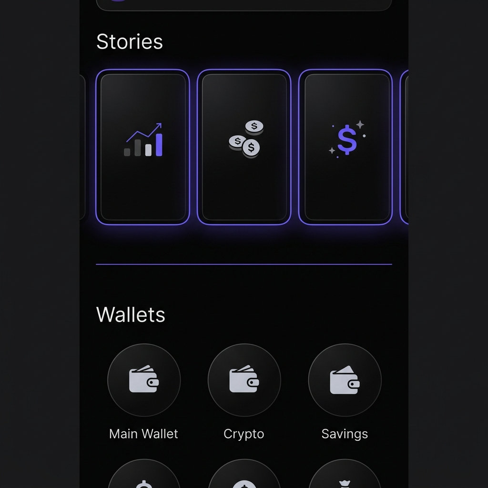

# Концепция "Сторис" (Stories) в CoinLover

Внедрение формата сторис (Stories) над строкой **Кошельки** — это мощный инструмент для повышения удержания (retention), геймификации и мягкого вовлечения пользователя в ручной учет без навязчивых пушей. 

Ниже представлена детальная концепция контента, UI/UX и технической реализации сторис, адаптированная под философию **CoinLover** (осознанность, ручной ввод, отсутствие автосинхронизации с банками) и дизайн-код **Linear Style** (Glassmorphism, темная тема, плавные микроанимации).

---

## 🎯 Смысловые категории Сторис

### 1. Финансовая гигиена и Осознанность (Mindfulness & Hygiene)
*Фокусирует пользователя на ручном вводе и анализе импульсивных покупок.*

*   **«Вечерний ритуал» (Clear Your Mind) 🧘‍♂️**
    *   *Когда:* Появляется каждый день в 21:00, если за день не было введено ни одной транзакции.
    *   *Контент:* "Время очистить разум и кошелек. Запиши сегодняшние расходы в пару кликов, чтобы завершить день с чистой финансовой кармой".
    *   *Интерактив:* Кнопка "Ввести расходы", которая открывает шторку быстрого ввода.
*   **«Челлендж: День без трат» (No-Spend Day) 🔥**
    *   *Когда:* В дни, когда траты отсутствуют.
    *   *Контент:* Кольцевой прогресс-бар: "Уже 2-й день без лишних трат! Твой кошелек говорит тебе спасибо. Удержим темп?".
    *   *Интерактив:* Визуальный счетчик дней "страйка" (streak) с анимацией огня.
*   **«Аудит подписок» (Subscription Alert) 💳**
    *   *Когда:* За 2 дня до регулярного платежа (на основе прошлых месяцев).
    *   *Контент:* "Послезавтра спишется подписка на Netflix (12.99 $ / ~1,200 ₽). Этот сервис всё ещё приносит тебе радость? Если нет — время отменить".
    *   *Интерактив:* Кнопка "Уже отменил" (архивирует регулярную транзакцию) или "Ок".

---

### 2. ИИ-Инсайты от встроенного AI-Аналитика (AI-Driven Analytics)
*Работает в связке с планируемым Gemini AI-аналитиком, обрабатывающим CSV-выгрузку из Google Sheets.*

*   **«Аномальный расход» ⚠️**
    *   *Когда:* При обнаружении нетипично крупного списания по категории.
    *   *Контент:* "Вчера в категории **'Кафе'** зафиксирована нетипичная трата 4,500 ₽ (на 180% выше твоего среднего чека). Это был особый случай?".
    *   *Интерактив:* Возможность быстро тапнуть и прикрепить тег `#праздник` или `#импульсивно`.
*   **«Прогноз на конец месяца» 🔮**
    *   *Когда:* Во второй половине месяца.
    *   *Контент:* "При текущем темпе трат твой свободный остаток к 31 числу составит около **18,400 ₽**. Ты тратишь на 8% меньше, чем в прошлом месяце. Отличный тренд!".
    *   *Интерактив:* График-прогноз (минималистичный sparkline).
*   **«Скрытый отток» 💸**
    *   *Когда:* Раз в неделю.
    *   *Контент:* "Мелочи имеют значение. За последние 14 дней на кофе на вынос незаметно ушло **3,600 ₽**. Это 12% твоего бюджета на еду".

---

### 3. Геймификация и Прогресс Целей (Goals & Gamification)
*Превращает скучные накопления в интерактивную игру.*

*   **«Прогресс финансовой цели» 🎯**
    *   *Когда:* При изменении баланса накопительных счетов.
    *   *Контент:* "Цель **'Отпуск в Азии'** заполнена на **78%**! Осталось отложить всего 22,000 ₽".
    *   *Интерактив:* Кнопка "Пополнить сейчас" с красивым Drag & Drop жестом прямо внутри сторис.
*   **«Финансовый щит» (Emergency Fund) 🛡️**
    *   *Когда:* Раз в месяц при подведении итогов.
    *   *Контент:* "Твоя финансовая подушка безопасности выросла до 150,000 ₽. При текущем уровне расходов этого хватит на **4.2 месяца** полной автономности. Стабильность!".

---

### 4. Контекст путешествий (Travel-Ready features)
*Для пользователей, ведущих учет в поездках и разных валютах.*

*   **«Курсы валют в реальном времени» ✈️**
    *   *Когда:* При смене геопозиции или транзакциях в неосновной валюте.
    *   *Контент:* "Привет из Тбилиси! Текущий курс: **1 GEL = 34.2 ₽**. Все твои лимиты автоматически пересчитываются по этому курсу".
*   **«Валютный сплит» 💱**
    *   *Контент:* "В этом месяце ты потратил **450 USD** и **32,000 ₽**. Нажми, чтобы посмотреть детальную разбивку по конвертации".

---

### 5. Обучение фишкам приложения (Pro Tips & Hidden Gems)
*Повышает конверсию в продвинутые функции приложения.*

*   **«Скрытые жесты» (Shortcuts) ⚙️**
    *   *Контент:* Короткая зацикленная микроанимация (Lottie): "Зажми иконку кошелька на 1.5 секунды, чтобы войти в режим изменения порядка (Drag & Sort)".
*   **«Голосовой ввод через Telegram» 🤖**
    *   *Контент:* "Устал вводить руками? Отправляй транзакции голосом через нашего Telegram-бота. Он распознает фразы типа *'1500 рублей на бензин'* и запишет их в таблицу".
    *   *Интерактив:* Кнопка "Подключить бота" (Deep Link).

---

## 🎨 UI/UX Спецификация (Linear Style)

### Визуальное представление (Над строкой "Кошельки")
1.  **Компоновка:**
    *   Горизонтальный скролл круглых или скругленных прямоугольных иконок (размер ~64x64px или 72x84px для вертикальных карточек превью).
    *   Располагается сразу под шапкой PWA и над заголовком `<h2>Кошельки</h2>`.
2.  **Эстетика кружков превью:**
    *   Фон: полупрозрачный `var(--glass-item-bg)` с размытием `backdrop-filter: blur(12px)`.
    *   Границы (Border): тонкая рамка 1px.
        *   *Непросмотренные:* Градиентный светящийся бордер (фиолетовый акцент `#6d5dfc` -> розовый/неоновый).
        *   *Просмотренные:* Тонкий серый полупрозрачный бордер `rgba(255,255,255,0.1)`.
    *   Иконка внутри: Яркий, но благородный монохромный эмодзи или кастомная векторная иконка с мягким свечением.
3.  **Экран просмотра сторис (Full Screen Modal):**
    *   Размытый затемненный фон (Glassmorphism оверлей).
    *   Сегментированный индикатор прогресса (Progress Bar) сверху, как в Instagram (автопереключение через 5 секунд).
    *   Плавный переход (View Transitions API) при открытии и закрытии свайпом вниз.
    *   **Микро-вибрации:** Легкий тактильный отклик (Haptic Feedback) на iOS/Android при переключении слайдов.

---

## 🛠 Техническая реализация (Архитектура)

1.  **Локальный движок сторис (Client-side Engine):**
    *   Сторис делятся на **статические** (обучение, советы) и **динамические** (вычисляемые на основе данных Google Sheets).
    *   Статические хранятся в JSON-конфиге на фронтенде.
    *   Динамические генерируются простым хуком `useStoriesGenerator(accounts, transactions, limits)`. Не требуется держать тяжелую базу на сервере — клиент сам рассчитывает аномалии, цели и страйки на основе кэшированных в памяти данных.
2.  **ИИ-сторис через бэкенд:**
    *   При синхронизации с Google Sheets бэкенд на Python запускает легкий фоновый скрипт анализа.
    *   Если ИИ находит интересный инсайт, он записывает его в скрытую техническую вкладку Google Sheets `__system_insights__` или передает в кэш сессии.
    *   При запуске приложение считывает инсайты и рендерит уникальную "ИИ-сторис" со значком Sparkles ✨.
3.  **Persistence (Сохранение состояния):**
    *   ID просмотренных сторис сохраняются in `localStorage`, чтобы не показывать их повторно. Кэш сбрасывается раз в неделю или при выходе новых системных обновлений.
